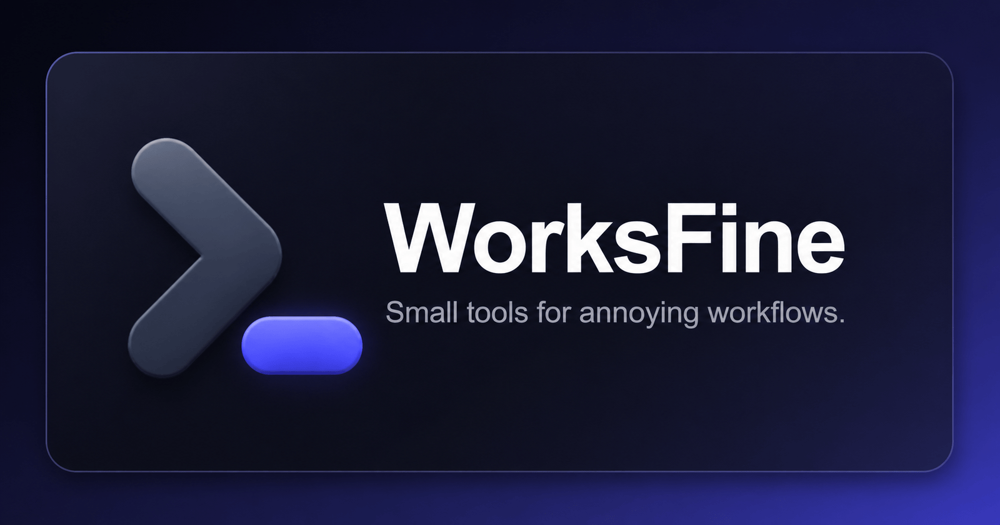

  

<h1 align="center">WorksFine</h1>

  Small tools for annoying workflows.

  I build focused Mac apps, CLI tools, and lightweight utilities that keep everyday work moving.

  <a href="https://worksfine.dev">Website</a> •
  <a href="https://github.com/Architeg/gloss">Gloss</a> •
  <a href="https://worksfine.dev/blog">Blog</a> •
  <a href="https://github.com/sponsors/Architeg">Sponsor</a>

---

## Projects

### 📝 Gloss

A local-first command glossary for your terminal.

Gloss helps save reusable shell commands with descriptions and tags, browse/search them in a TUI, scan zsh/bash configs, and safely sync managed aliases with backups.

- GitHub: https://github.com/Architeg/gloss
- Website: https://worksfine.dev/gloss/

## Tech stack

Tools and languages I use across WorksFine projects:

  
  
  
  
  
  
  
  
  
  

## Support

If something I build saves you time or becomes part of your workflow, you can share it, star the repo, or support the work here:

  
   
  

---

  WorksFine — small tools for annoying workflows.

